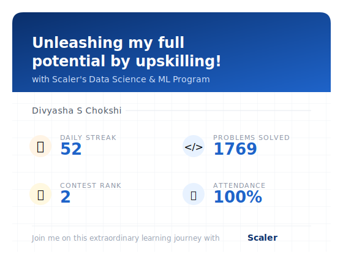

<h1 align="center">
  
</h1>

  
  
  
  

  
  
  

---

### 🌟 About Me

I started learning AI hands-on by building my own **Local AI Studio** — a personal setup where I could experiment with LLM tools, agent frameworks, and automation instead of just reading about them. That hands-on foundation turned into real skill: designing multi-agent LLM pipelines, working with retrieval systems, and automating workflows end to end.

I hold a completed **Master's in Artificial Intelligence & Machine Learning (June 2025)**, and I'm now exploring turning that skill into an **AI consulting practice** — starting small and real. So far that's meant taking on a couple of early projects: building a piece of custom software and a website from the ground up, using them as proof that I can take an AI/automation idea from concept to something a client can actually use.

My work sits at the intersection of three things most ML portfolios treat separately:

- 🧠 **Applied ML/DL** — from CNNs and NLP pipelines to forecasting and causal inference
- 🤖 **Agentic AI Engineering** — orchestrated, memory-anchored multi-agent systems using the Claude API, LangChain, and LlamaIndex, built and tested in my Local AI Studio
- ⚙️ **Automation Infrastructure** — Make.com / n8n workflows that turn agent output into something usable

📍 New Jersey, USA — open to **remote / hybrid** roles only.
🎯 Currently pursuing **Anthropic AI courses** and interviewing for **AI Engineer / Data Engineer** roles.

---

### 🧩 Signature Build — Local AI Studio Multi-Agent System

> The project that best represents how I think: agentic, reusable, learned from the ground up.

A locally-orchestrated multi-agent architecture I built inside my own Local AI Studio, on the **Claude API**, using **LangChain** and **LlamaIndex** for retrieval and tool-routing between specialized agents. Each agent is memory-anchored with a defined trigger and role — planner, executor, retriever, critic — designed to be **reusable across domains** rather than rebuilt per use case. This is the architecture I'm now applying to real early client work.

`Claude API` `LangChain` `LlamaIndex` `Python` `Vector Retrieval` `Agent Orchestration`

---

### 🛠️ Tech Stack

  
  
  
  
  

  
  
  
  

  
  
  
  
  

  
  
  
  

---

### ☁️ Featured Cloud Architecture — Master's Capstone

**Azure-Based Machine Learning Data Pipeline**
`Azure Data Factory` `Databricks` `Apache Spark (Structured Streaming)` `Unity Catalog` `Azure SQL DB`

Engineered an end-to-end cloud ingestion and orchestration platform for big-data scale. Handled high-velocity DataFrame transformations, enforced fine-grained metadata governance via Unity Catalog, and built custom trigger-pricing architecture to optimize automation costs.

---

### 🚀 Project Portfolio

<b>🧠 Deep Learning, Computer Vision & NLP</b>

 

| Project | Focus | Stack |
|---|---|---|
| 🤖 **Ninjacart** — CV Classification Pipeline | Automated multi-class warehouse image classification for India's largest fresh-produce supply chain, using CNNs + Transfer Learning (ResNet/VGG) with OpenCV preprocessing | `TensorFlow` `Keras` `OpenCV` `CNN` `Transfer Learning` |
| 🚚 **Porter** — Neural Network ETA Regression | Real-time delivery-time estimation over high-density, multi-collinear logistics features | `PyTorch` `Keras` `Adam Optimizer` `Pandas` |
| 🐦 **Twitter** — NER NLP Engine | Extracted structured entities (brands, locations, hashtags) from noisy social text for downstream sentiment pipelines | `NLTK` `SpaCy` `Regex` `Word Embeddings` |
| 📰 **FlipitNews** — Text Categorization Engine | Benchmarked classical ML against LSTM + GloVe embeddings for financial/geopolitical article classification | `TF-IDF` `LSTM` `GloVe` `Scikit-learn` |

<b>📊 Recommenders, Clustering & Predictive Modeling</b>

 

| Project | Focus | Stack |
|---|---|---|
| 📺 **Zee** — Hybrid Recommender System | Personalized content discovery combining demographic matrices with Matrix Factorization + Cosine/Pearson similarity | `NumPy` `Sparse Matrices` `Scikit-learn` |
| 📈 **AdEase** — Time Series Forecasting | Forecasted 550 days of multilingual streaming views using ARIMA, SARIMAX, and Prophet | `Statsmodels` `Prophet` `Seaborn` |
| 📦 **Scaler** — Clustering & Learner Analytics | Unsupervised B2B user profiling via K-Means, Hierarchical Clustering, and PCA-reduced features | `PCA` `Silhouette Scoring` |
| 🚖 **OLA** — Ensemble Attrition Modeling | Predicted driver/customer churn with Random Forest, Gradient Boosting & XGBoost under class imbalance | `SMOTE` `KNN Imputer` `XGBoost` |
| 💳 **LoanTap** — Credit Risk Pipeline | Logistic regression underwriting model across DTI ratios, revolving lines & employment profiles | `Statsmodels` `ROC-AUC` |
| 🎓 **Jamboree** — Admissions Predictor | Ridge/Lasso regression with VIF-based multicollinearity control for graduate admissions | `Ridge` `Lasso` `VIF` |

<b>⚙️ Data Engineering & Statistical Inference</b>

 

| Project | Focus | Stack |
|---|---|---|
| 🎯 **Target** — SQL Macro-Operations | Queried a 100K+ item retail warehouse using window functions and multi-stage joins | `BigQuery` `MySQL` `Window Functions` |
| 📦 **Delhivery** — Feature Engineering Pipeline | Rolled up noisy telemetry into production-grade delivery tables validated against OSRM | `Pandas` `IQR` `One-Hot Encoding` |
| 🚲 **Yulu** — Hypothesis Testing Infrastructure | ANOVA, Chi-Square & t-tests to isolate environmental drivers of micro-mobility demand | `SciPy Stats` `ANOVA` |
| 🛒 **Walmart** — CLT & Confidence Intervals | Simulated Central Limit Theorem behavior over skewed Black Friday transaction data | `SciPy` `CLT Simulations` |
| 🏋️ **Aerofit** — Probability Modeling | Conditional/joint probability matrices for equipment-tier conversion analysis | `Pandas Crosstabs` `Heatmaps` |
| 📺 **Netflix** — Catalog Trend Exploration | Global content trend mapping across director/actor frequency and regional shifts | `Matplotlib` `WordCloud` |

---

### 🚀 Early Client Work — Testing the Consulting Path

I'm exploring turning my AI skills into a consulting practice, and I'm starting the way I think anyone should: with small, real projects instead of big claims.

- 🖥️ **Custom software build** — took a project from requirements to a working delivered tool, applying the same agentic/automation thinking from my Local AI Studio to a real use case
- 🌐 **Website build** — designed and built a site end to end, from concept to deployment

These are early, deliberately small steps — proof that I can carry an idea from "what if" to something a person can actually use, before scaling up to bigger consulting engagements.

---

### 🎯 Product & Cross-Functional Range

I approach ML systems with a product mindset — AARRR & HEART frameworks, PRDs, sprint planning, and clean developer handoffs.

- 🥇 Contest-winning performance in a **Product Management for Software Engineers** competition
- 🛠️ Comfortable across the full loop: PRDs → Jira sprints → Figma concepts → engineering handoff

---

### 📈 Learning Journey

  

---

### 💬 Let's Build at Scale

I'm actively interviewing for **AI Engineer** and **Data Engineer** roles (remote/hybrid), deepening my expertise through **Anthropic AI courses**, and taking on small early projects as I explore AI consulting. If you're building agentic systems, LLM infrastructure, or ML platforms — let's talk.

  
  

